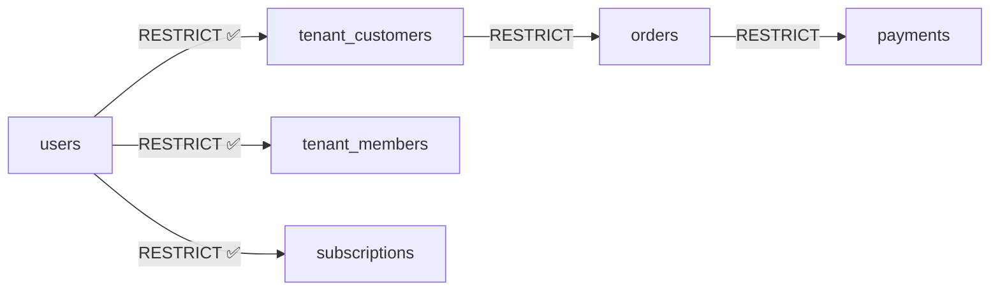
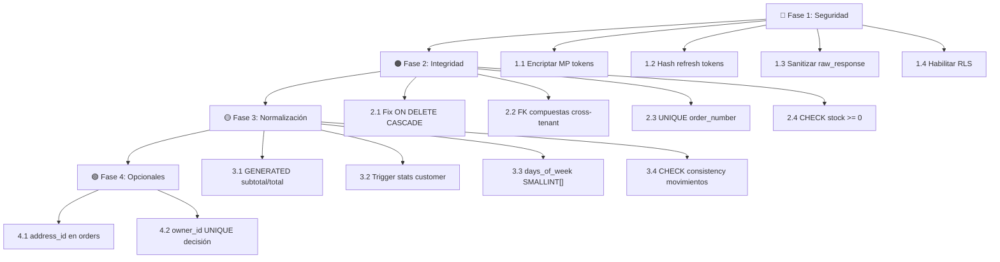

# Plan de Mejora de Base de Datos — NexoFood API

## Descripción del Objetivo

Mejorar el esquema de base de datos de NexoFood (PostgreSQL + Spring Boot 4 / JPA) para cerrar vulnerabilidades de seguridad, fortalecer la integridad referencial multi-tenant, y corregir violaciones de normalización — **sin romper la API existente**.

El plan se organiza en **4 fases** ejecutables de forma incremental. Cada fase es autocontenida y desplegable de forma independiente.

---

## User Review Required

> [!IMPORTANT]
> **Encriptación de credenciales MP:** Se propone encriptar a nivel de aplicación con AES-256-GCM usando una `ENCRYPTION_KEY` en variables de entorno. Esto requiere definir dónde se almacenará la clave maestra (env var, Vault, AWS KMS, etc.). ¿Cuál prefieres?

> [!WARNING]
> **RLS en PostgreSQL:** Habilitar Row Level Security requiere que la conexión JDBC establezca `SET app.current_tenant_id = '<uuid>'` al inicio de cada transacción. Esto se implementa como un interceptor de Hibernate. Si usas connection pooling (HikariCP), se debe limpiar el setting al devolver la conexión al pool. ¿Estás usando HikariCP por defecto?

> [!CAUTION]
> **Migración de refresh_tokens:** Cambiar de `token TEXT` a `token_hash VARCHAR(64)` **invalida todos los tokens activos**. Los usuarios tendrán que re-autenticarse. ¿Es aceptable un corte de sesión único durante el despliegue?

---

## Open Questions

1. **¿Usan Flyway o Liquibase para migraciones?** Si no, ¿quieres que genere scripts SQL directos o que implemente Flyway?
2. **¿Existe un KMS/Vault en la infraestructura actual?** Esto determina si la clave AES se lee de env vars o de un servicio externo.
3. **¿El owner_id UNIQUE en tenants es una restricción de negocio intencional?** Tu análisis lo mencionó como limitante. ¿Quieres permitir que un usuario sea owner de múltiples tenants en el futuro?
4. **¿El campo `days_of_week` en product_prices se consume actualmente en la API?** Necesito saber si hay endpoints activos que lo leen/escriben para planificar la migración sin romper nada.

---

## Validación del Análisis

Antes de presentar los cambios, confirmo que **todos los hallazgos del análisis son correctos** tras verificar el [script.sql](file:///home/abdieeel/proyectos/nexofood-api/script.sql) y las entidades JPA:

| Hallazgo | ¿Correcto? | Nota |
|---|---|---|
| Credenciales MP en texto plano | ✅ | `mp_access_token`, `mp_refresh_token`, `mp_public_key` como `TEXT` simple en [Tenant.java](file:///home/abdieeel/proyectos/nexofood-api/src/main/java/lat/nexofood/api/modules/store/domain/Tenant.java) |
| Refresh tokens legibles | ✅ | `token TEXT NOT NULL UNIQUE` en `refresh_tokens`, [RefreshTokenService](file:///home/abdieeel/proyectos/nexofood-api/src/main/java/lat/nexofood/api/modules/identity/application/service/RefreshTokenService.java) busca por texto plano via `findByToken()` |
| `raw_response` sin sanitizar | ✅ | [PaymentMapper](file:///home/abdieeel/proyectos/nexofood-api/src/main/java/lat/nexofood/api/modules/payment/web/mapper/PaymentMapper.java) copia `request.rawResponse()` directo sin filtrar |
| Sin RLS | ✅ | Cero `ENABLE ROW LEVEL SECURITY` o `CREATE POLICY` en el script. Sin `@Filter`/`@Where` en entidades JPA |
| ON DELETE CASCADE destructivo | ✅ | `tenant_customers.user_id ON DELETE CASCADE` encadena con `orders.customer_id ON DELETE RESTRICT` → conflicto |
| Cross-tenant leakage en cart_items/order_items | ✅ | FK simple `product_id → products(id)` sin validar tenant |
| Colisión de order_number | ✅ | Sin `UNIQUE(tenant_id, order_number)`, solo un índice no-único |
| Sin CHECK en inventory_stocks.quantity | ✅ | Puede ir negativo |
| Campos calculados sin garantía (subtotal, total) | ✅ | Ninguna columna `GENERATED ALWAYS AS` ni trigger de cálculo |
| `total_orders`/`first_order_at`/`last_order_at` redundantes | ✅ | Desnormalización sin triggers de sincronización |
| `performed_by_name` rompe 3NF | ✅ | Snapshot histórico intencional — **aceptable como diseño** |
| `days_of_week VARCHAR(100)` viola 1NF | ✅ | String CSV, no atómico |
| Redundancia `previous_quantity`/`new_quantity`/`quantity` | ✅ | Los 3 se almacenan, `new_quantity = previous_quantity ± quantity` |

> [!NOTE]
> **`performed_by_name` en `inventory_movements`**: Aunque técnicamente rompe 3NF, este es un patrón de **fotografía histórica (audit snapshot)** ampliamente aceptado. Si un empleado cambia de nombre, el registro de inventario preserva quién lo hizo en ese momento. **Se recomienda conservarlo tal cual.** No se incluye en los cambios.

> [!NOTE]
> **`product_name` en `order_items`**: Mismo caso de snapshot histórico. El nombre del producto al momento de la orden debe preservarse inmutable. **Se conserva.**

---

## Proposed Changes

### Fase 1 — Seguridad Crítica (Prioridad: 🔴 Máxima)

---

#### 1.1 Encriptación de Credenciales Mercado Pago

##### [MODIFY] `script.sql` — Tabla `tenants`

Renombrar columnas para indicar que son cifradas:

```sql
-- Cambiar tipo a BYTEA para almacenar el ciphertext binario
ALTER TABLE tenants RENAME COLUMN mp_access_token TO mp_access_token_enc;
ALTER TABLE tenants ALTER COLUMN mp_access_token_enc TYPE BYTEA USING NULL;

ALTER TABLE tenants RENAME COLUMN mp_refresh_token TO mp_refresh_token_enc;
ALTER TABLE tenants ALTER COLUMN mp_refresh_token_enc TYPE BYTEA USING NULL;

ALTER TABLE tenants RENAME COLUMN mp_public_key TO mp_public_key_enc;
ALTER TABLE tenants ALTER COLUMN mp_public_key_enc TYPE BYTEA USING NULL;
```

##### [NEW] `CryptoService.java`

Servicio de encriptación AES-256-GCM a nivel de aplicación:

```java
package lat.nexofood.api.common.security;

import javax.crypto.Cipher;
import javax.crypto.SecretKey;
import javax.crypto.spec.GCMParameterSpec;
import javax.crypto.spec.SecretKeySpec;
import java.security.SecureRandom;
import java.util.Base64;

@Service
public class CryptoService {

    private static final String ALGORITHM = "AES/GCM/NoPadding";
    private static final int GCM_TAG_LENGTH = 128;
    private static final int IV_LENGTH = 12;

    private final SecretKey secretKey;

    public CryptoService(@Value("${nexofood.crypto.master-key}") String base64Key) {
        byte[] decodedKey = Base64.getDecoder().decode(base64Key);
        this.secretKey = new SecretKeySpec(decodedKey, "AES");
    }

    public byte[] encrypt(String plaintext) {
        // IV (12 bytes) + ciphertext + GCM tag
        byte[] iv = new byte[IV_LENGTH];
        new SecureRandom().nextBytes(iv);
        Cipher cipher = Cipher.getInstance(ALGORITHM);
        cipher.init(Cipher.ENCRYPT_MODE, secretKey, 
                     new GCMParameterSpec(GCM_TAG_LENGTH, iv));
        byte[] ciphertext = cipher.doFinal(plaintext.getBytes());
        byte[] result = new byte[IV_LENGTH + ciphertext.length];
        System.arraycopy(iv, 0, result, 0, IV_LENGTH);
        System.arraycopy(ciphertext, 0, result, IV_LENGTH, ciphertext.length);
        return result;
    }

    public String decrypt(byte[] encryptedData) {
        byte[] iv = Arrays.copyOfRange(encryptedData, 0, IV_LENGTH);
        byte[] ciphertext = Arrays.copyOfRange(encryptedData, IV_LENGTH, 
                                                encryptedData.length);
        Cipher cipher = Cipher.getInstance(ALGORITHM);
        cipher.init(Cipher.DECRYPT_MODE, secretKey, 
                     new GCMParameterSpec(GCM_TAG_LENGTH, iv));
        return new String(cipher.doFinal(ciphertext));
    }
}
```

##### [MODIFY] [Tenant.java](file:///home/abdieeel/proyectos/nexofood-api/src/main/java/lat/nexofood/api/modules/store/domain/Tenant.java)

Cambiar los campos de MP a `byte[]` y usar un `@Converter` JPA:

```java
// Antes:
@Column(name = "mp_access_token", columnDefinition = "TEXT")
private String mpAccessToken;

// Después:
@Column(name = "mp_access_token_enc", columnDefinition = "BYTEA")
@Convert(converter = EncryptedStringConverter.class)
@ToString.Exclude
private String mpAccessToken; // Sigue siendo String en la API
```

##### [NEW] `EncryptedStringConverter.java`

JPA `AttributeConverter` que encripta/desencripta transparentemente:

```java
@Converter
public class EncryptedStringConverter implements AttributeConverter<String, byte[]> {

    // Se inyecta vía ApplicationContextProvider (static accessor pattern)
    // porque JPA Converters no soportan @Autowired directamente
    
    @Override
    public byte[] convertToDatabaseColumn(String attribute) {
        if (attribute == null) return null;
        return getCryptoService().encrypt(attribute);
    }

    @Override
    public String convertToEntityAttribute(byte[] dbData) {
        if (dbData == null) return null;
        return getCryptoService().decrypt(dbData);
    }
}
```

**Impacto en la API:** Cero. Los endpoints siguen recibiendo/devolviendo Strings. La conversión es transparente en la capa JPA.

---

#### 1.2 Hash de Refresh Tokens

##### [MODIFY] `script.sql` — Tabla `refresh_tokens`

```sql
-- Migración destructiva (invalida tokens activos)
ALTER TABLE refresh_tokens DROP COLUMN token;
ALTER TABLE refresh_tokens ADD COLUMN token_hash VARCHAR(64) NOT NULL;
CREATE UNIQUE INDEX idx_refresh_tokens_token_hash ON refresh_tokens(token_hash);
DROP INDEX IF EXISTS idx_refresh_tokens_token;
```

##### [MODIFY] [RefreshToken.java](file:///home/abdieeel/proyectos/nexofood-api/src/main/java/lat/nexofood/api/modules/identity/domain/RefreshToken.java)

```java
// Antes:
@Column(columnDefinition = "TEXT", nullable = false, unique = true)
private String token;

// Después:
@Column(name = "token_hash", length = 64, nullable = false, unique = true)
private String tokenHash;
```

##### [MODIFY] [RefreshTokenService.java](file:///home/abdieeel/proyectos/nexofood-api/src/main/java/lat/nexofood/api/modules/identity/application/service/RefreshTokenService.java)

```java
// Al crear un token:
String rawToken = jwtService.generateRefreshToken(user);
String hash = DigestUtils.sha256Hex(rawToken);
RefreshToken entity = RefreshToken.builder()
    .tokenHash(hash)
    .user(user)
    .expiryDate(...)
    .build();
refreshTokenRepository.save(entity);

// Al buscar para validar:
String hash = DigestUtils.sha256Hex(request.refreshToken());
RefreshToken currentToken = refreshTokenRepository.findByTokenHash(hash)
    .orElseThrow(...);
```

##### [MODIFY] `RefreshTokenRepository.java`

```java
// Antes:
Optional<RefreshToken> findByToken(String token);

// Después:
Optional<RefreshToken> findByTokenHash(String tokenHash);
```

**Impacto en la API:** El cliente sigue enviando/recibiendo el token raw. Solo cambia el almacenamiento interno.

---

#### 1.3 Sanitización de `raw_response` en Payments

##### [MODIFY] [PaymentMapper.java](file:///home/abdieeel/proyectos/nexofood-api/src/main/java/lat/nexofood/api/modules/payment/web/mapper/PaymentMapper.java)

```java
// Antes:
.rawResponse(request.rawResponse())

// Después:
.rawResponse(sanitizePaymentResponse(request.rawResponse()))

private String sanitizePaymentResponse(String rawJson) {
    if (rawJson == null) return null;
    ObjectMapper mapper = new ObjectMapper();
    JsonNode root = mapper.readTree(rawJson);
    ObjectNode sanitized = mapper.createObjectNode();
    
    // Solo campos necesarios para operaciones y conciliación
    copyIfPresent(root, sanitized, "id");
    copyIfPresent(root, sanitized, "status");
    copyIfPresent(root, sanitized, "status_detail");
    copyIfPresent(root, sanitized, "payment_method_id");
    copyIfPresent(root, sanitized, "payment_type_id");
    copyIfPresent(root, sanitized, "transaction_amount");
    copyIfPresent(root, sanitized, "currency_id");
    copyIfPresent(root, sanitized, "date_created");
    copyIfPresent(root, sanitized, "date_approved");
    copyIfPresent(root, sanitized, "external_reference");
    copyIfPresent(root, sanitized, "installments");
    copyIfPresent(root, sanitized, "issuer_id");
    // NUNCA copiar: card, payer.email, payer.identification, etc.
    
    return sanitized.toString();
}
```

**Impacto en la API:** `raw_response` devuelve JSON más limpio. No hay breaking change.

---

#### 1.4 Row Level Security (RLS) Multi-Tenant

##### [MODIFY] `script.sql` — Habilitar RLS

```sql
-- Habilitar RLS en todas las tablas tenant-scoped
ALTER TABLE tenant_members ENABLE ROW LEVEL SECURITY;
ALTER TABLE tenant_customers ENABLE ROW LEVEL SECURITY;
ALTER TABLE categories ENABLE ROW LEVEL SECURITY;
ALTER TABLE products ENABLE ROW LEVEL SECURITY;
ALTER TABLE carts ENABLE ROW LEVEL SECURITY;
ALTER TABLE cart_items ENABLE ROW LEVEL SECURITY;
ALTER TABLE orders ENABLE ROW LEVEL SECURITY;
ALTER TABLE order_items ENABLE ROW LEVEL SECURITY;
ALTER TABLE payments ENABLE ROW LEVEL SECURITY;
ALTER TABLE inventory_items ENABLE ROW LEVEL SECURITY;
ALTER TABLE inventory_stocks ENABLE ROW LEVEL SECURITY;
ALTER TABLE inventory_movements ENABLE ROW LEVEL SECURITY;

-- Política por tenant para tablas directas
CREATE POLICY tenant_isolation ON tenant_members
    USING (tenant_id = current_setting('app.current_tenant_id')::UUID);
CREATE POLICY tenant_isolation ON tenant_customers
    USING (tenant_id = current_setting('app.current_tenant_id')::UUID);
CREATE POLICY tenant_isolation ON categories
    USING (tenant_id = current_setting('app.current_tenant_id')::UUID);
CREATE POLICY tenant_isolation ON products
    USING (tenant_id = current_setting('app.current_tenant_id')::UUID);
CREATE POLICY tenant_isolation ON carts
    USING (tenant_id = current_setting('app.current_tenant_id')::UUID);
CREATE POLICY tenant_isolation ON orders
    USING (tenant_id = current_setting('app.current_tenant_id')::UUID);
CREATE POLICY tenant_isolation ON payments
    USING (tenant_id = current_setting('app.current_tenant_id')::UUID);
CREATE POLICY tenant_isolation ON inventory_items
    USING (tenant_id = current_setting('app.current_tenant_id')::UUID);
CREATE POLICY tenant_isolation ON inventory_stocks
    USING (tenant_id = current_setting('app.current_tenant_id')::UUID);
CREATE POLICY tenant_isolation ON inventory_movements
    USING (tenant_id = current_setting('app.current_tenant_id')::UUID);

-- Para tablas indirectas (necesitan subquery al padre)
CREATE POLICY tenant_isolation ON cart_items
    USING (cart_id IN (SELECT id FROM carts));
CREATE POLICY tenant_isolation ON order_items
    USING (order_id IN (SELECT id FROM orders));
```

##### [NEW] `TenantConnectionPreparer.java`

```java
@Component
public class TenantConnectionPreparer {
    
    @PersistenceContext
    private EntityManager entityManager;
    
    /**
     * Ejecuta SET LOCAL para que RLS filtre por tenant.
     * SET LOCAL solo dura hasta el final de la transacción actual.
     */
    @Transactional
    public void setTenantForCurrentTransaction(UUID tenantId) {
        entityManager.createNativeQuery(
            "SET LOCAL app.current_tenant_id = :tenantId"
        ).setParameter("tenantId", tenantId.toString()).executeUpdate();
    }
}
```

> [!WARNING]
> **El usuario de BD de la aplicación NO debe ser superuser.** Los superusers bypasean RLS automáticamente. Se debe crear un rol dedicado `nexofood_app` con `GRANT` explícitos.

**Impacto en la API:** Requiere un interceptor/filtro que establezca el tenant antes de cada operación. Actúa como red de seguridad adicional.

---

### Fase 2 — Integridad Referencial y Lógica de Negocio (Prioridad: 🟠 Alta)

---

#### 2.1 Corregir ON DELETE CASCADE destructivo + Soft Delete

##### [MODIFY] `script.sql`

```sql
-- tenant_customers.user_id: CASCADE → RESTRICT
ALTER TABLE tenant_customers
    DROP CONSTRAINT tenant_customers_user_id_fkey,
    ADD CONSTRAINT tenant_customers_user_id_fkey
        FOREIGN KEY (user_id) REFERENCES users(id) ON DELETE RESTRICT;

-- subscriptions.user_id: CASCADE → RESTRICT
ALTER TABLE subscriptions
    DROP CONSTRAINT subscriptions_user_id_fkey,
    ADD CONSTRAINT subscriptions_user_id_fkey
        FOREIGN KEY (user_id) REFERENCES users(id) ON DELETE RESTRICT;

-- tenant_members.user_id: CASCADE → RESTRICT
ALTER TABLE tenant_members
    DROP CONSTRAINT tenant_members_user_id_fkey,
    ADD CONSTRAINT tenant_members_user_id_fkey
        FOREIGN KEY (user_id) REFERENCES users(id) ON DELETE RESTRICT;

-- Soft delete column
ALTER TABLE users ADD COLUMN deleted_at TIMESTAMPTZ;
```

##### [MODIFY] [User.java](file:///home/abdieeel/proyectos/nexofood-api/src/main/java/lat/nexofood/api/modules/identity/domain/User.java)

```java
@Column(name = "deleted_at")
private OffsetDateTime deletedAt;
```

**Cadena de dependencias corregida:**



---

#### 2.2 Prevenir Cross-Tenant Leakage (FK compuestas)

##### [MODIFY] `script.sql`

```sql
-- UNIQUE compuesto en products
ALTER TABLE products ADD CONSTRAINT uk_products_id_tenant UNIQUE (id, tenant_id);

-- Agregar tenant_id a cart_items
ALTER TABLE cart_items ADD COLUMN tenant_id UUID;
UPDATE cart_items ci SET tenant_id = c.tenant_id FROM carts c WHERE ci.cart_id = c.id;
ALTER TABLE cart_items ALTER COLUMN tenant_id SET NOT NULL;
ALTER TABLE cart_items
    DROP CONSTRAINT cart_items_product_id_fkey,
    ADD CONSTRAINT cart_items_product_tenant_fkey
        FOREIGN KEY (product_id, tenant_id) REFERENCES products(id, tenant_id);

-- Agregar tenant_id a order_items
ALTER TABLE order_items ADD COLUMN tenant_id UUID;
UPDATE order_items oi SET tenant_id = o.tenant_id FROM orders o WHERE oi.order_id = o.id;
ALTER TABLE order_items ALTER COLUMN tenant_id SET NOT NULL;
ALTER TABLE order_items
    DROP CONSTRAINT IF EXISTS order_items_product_id_fkey,
    ADD CONSTRAINT order_items_product_tenant_fkey
        FOREIGN KEY (product_id, tenant_id) REFERENCES products(id, tenant_id);
```

##### [MODIFY] [CartItem.java](file:///home/abdieeel/proyectos/nexofood-api/src/main/java/lat/nexofood/api/modules/cart/domain/CartItem.java) y [OrderItem.java](file:///home/abdieeel/proyectos/nexofood-api/src/main/java/lat/nexofood/api/modules/order/domain/OrderItem.java)

```java
@ManyToOne(fetch = FetchType.LAZY)
@JoinColumn(name = "tenant_id", nullable = false)
@ToString.Exclude
private Tenant tenant;
```

---

#### 2.3 Unicidad de order_number por Tenant

##### [MODIFY] `script.sql`

```sql
ALTER TABLE orders 
    ADD CONSTRAINT uk_orders_tenant_number UNIQUE (tenant_id, order_number);
```

---

#### 2.4 CHECK de inventario no-negativo

##### [MODIFY] `script.sql`

```sql
ALTER TABLE inventory_stocks
    ADD CONSTRAINT chk_inventory_stocks_quantity_non_negative CHECK (quantity >= 0);
ALTER TABLE inventory_stocks
    ADD CONSTRAINT chk_inventory_stocks_reserved_non_negative CHECK (reserved_quantity >= 0);
```

> [!TIP]
> Para prevenir race conditions: usar `UPDATE ... SET quantity = quantity - :amount WHERE quantity >= :amount` o `SELECT ... FOR UPDATE`.

---

### Fase 3 — Normalización y Consistencia (Prioridad: 🟡 Media)

---

#### 3.1 Campos calculados: subtotal/total como GENERATED COLUMNS

##### [MODIFY] `script.sql`

```sql
-- cart_items.subtotal
ALTER TABLE cart_items DROP COLUMN subtotal;
ALTER TABLE cart_items ADD COLUMN subtotal NUMERIC(10, 2) 
    GENERATED ALWAYS AS (quantity * unit_price) STORED;

-- order_items.subtotal
ALTER TABLE order_items DROP COLUMN subtotal;
ALTER TABLE order_items ADD COLUMN subtotal NUMERIC(10, 2) 
    GENERATED ALWAYS AS (quantity * unit_price) STORED;

-- orders.total = subtotal + delivery_fee
ALTER TABLE orders DROP COLUMN total;
ALTER TABLE orders ADD COLUMN total NUMERIC(10, 2) 
    GENERATED ALWAYS AS (subtotal + delivery_fee) STORED;
```

Para `carts.total` (depende de otra tabla → trigger):

```sql
CREATE OR REPLACE FUNCTION update_cart_total() RETURNS TRIGGER AS $$
BEGIN
    UPDATE carts SET total = (
        SELECT COALESCE(SUM(quantity * unit_price), 0) 
        FROM cart_items WHERE cart_id = COALESCE(NEW.cart_id, OLD.cart_id)
    ) WHERE id = COALESCE(NEW.cart_id, OLD.cart_id);
    RETURN NEW;
END;
$$ LANGUAGE plpgsql;

CREATE TRIGGER trg_cart_items_sync_total
AFTER INSERT OR UPDATE OR DELETE ON cart_items
FOR EACH ROW EXECUTE FUNCTION update_cart_total();
```

##### [MODIFY] Entidades JPA — `insertable = false, updatable = false`

```java
@Column(name = "subtotal", precision = 10, scale = 2, 
        insertable = false, updatable = false)
private BigDecimal subtotal;
```

---

#### 3.2 Triggers para stats en `tenant_customers`

##### [MODIFY] `script.sql`

```sql
CREATE OR REPLACE FUNCTION sync_tenant_customer_stats() RETURNS TRIGGER AS $$
BEGIN
    UPDATE tenant_customers SET
        total_orders = (SELECT COUNT(*) FROM orders 
            WHERE customer_id = COALESCE(NEW.customer_id, OLD.customer_id)
              AND status != 'CANCELADO'),
        first_order_at = (SELECT MIN(created_at) FROM orders 
            WHERE customer_id = COALESCE(NEW.customer_id, OLD.customer_id)
              AND status != 'CANCELADO'),
        last_order_at = (SELECT MAX(created_at) FROM orders 
            WHERE customer_id = COALESCE(NEW.customer_id, OLD.customer_id)
              AND status != 'CANCELADO')
    WHERE id = COALESCE(NEW.customer_id, OLD.customer_id);
    RETURN NEW;
END;
$$ LANGUAGE plpgsql;

CREATE TRIGGER trg_orders_sync_customer_stats
AFTER INSERT OR UPDATE OF status OR DELETE ON orders
FOR EACH ROW EXECUTE FUNCTION sync_tenant_customer_stats();
```

---

#### 3.3 `days_of_week` → `SMALLINT[]`

##### [MODIFY] `script.sql`

```sql
ALTER TABLE product_prices ADD COLUMN days_of_week_arr SMALLINT[];
-- Migrar datos existentes (script específico según formato)
ALTER TABLE product_prices DROP COLUMN days_of_week;
ALTER TABLE product_prices RENAME COLUMN days_of_week_arr TO days_of_week;

ALTER TABLE product_prices ADD CONSTRAINT chk_product_prices_days_valid 
    CHECK (days_of_week <@ ARRAY[0,1,2,3,4,5,6]::SMALLINT[]);
CREATE INDEX idx_product_prices_days ON product_prices USING GIN(days_of_week);
```

##### [MODIFY] [ProductPrice.java](file:///home/abdieeel/proyectos/nexofood-api/src/main/java/lat/nexofood/api/modules/catalog/domain/ProductPrice.java)

```java
// Antes:
@Column(name = "days_of_week", length = 100)
private String daysOfWeek;

// Después:
@Column(name = "days_of_week", columnDefinition = "SMALLINT[]")
@JdbcTypeCode(SqlTypes.ARRAY)
private Short[] daysOfWeek;
```

> [!WARNING]
> **Breaking change en DTOs:** Los endpoints que reciben/devuelven `daysOfWeek` como String cambian a array de números. Requiere versionar el endpoint o migrar clientes frontend.

---

#### 3.4 CHECK de consistencia en `inventory_movements`

##### [MODIFY] `script.sql`

```sql
ALTER TABLE inventory_movements
    ADD CONSTRAINT chk_inventory_movements_quantity_consistency
    CHECK (
        (movement_type = 'ENTRY' AND new_quantity = previous_quantity + quantity) OR
        (movement_type = 'EXIT' AND new_quantity = previous_quantity - quantity) OR
        (movement_type = 'ADJUSTMENT')
    );
```

> [!NOTE]
> `ADJUSTMENT` no tiene check aritmético estricto porque la cantidad puede ser positiva o negativa según la corrección necesaria.

---

### Fase 4 — Mejoras Opcionales (Prioridad: 🟢 Baja)

---

#### 4.1 Referencia de dirección en orders

```sql
ALTER TABLE orders ADD COLUMN address_id UUID;
ALTER TABLE orders ADD CONSTRAINT fk_orders_address 
    FOREIGN KEY (address_id) REFERENCES customer_addresses(id) ON DELETE SET NULL;
CREATE INDEX idx_orders_address_id ON orders(address_id);
```

#### 4.2 `owner_id UNIQUE` — No cambiar por ahora

Si en el futuro se necesita multi-tenant por owner:
```sql
ALTER TABLE tenants DROP CONSTRAINT tenants_owner_id_key;
```

---

## Resumen de Archivos

| Archivo | Acción | Fase |
|---|---|---|
| [script.sql](file:///home/abdieeel/proyectos/nexofood-api/script.sql) | Modificar (múltiples ALTER/ADD) | 1-4 |
| [Tenant.java](file:///home/abdieeel/proyectos/nexofood-api/src/main/java/lat/nexofood/api/modules/store/domain/Tenant.java) | Modificar (campos MP encriptados) | 1 |
| [RefreshToken.java](file:///home/abdieeel/proyectos/nexofood-api/src/main/java/lat/nexofood/api/modules/identity/domain/RefreshToken.java) | Modificar (token → tokenHash) | 1 |
| [RefreshTokenService.java](file:///home/abdieeel/proyectos/nexofood-api/src/main/java/lat/nexofood/api/modules/identity/application/service/RefreshTokenService.java) | Modificar (hash SHA-256) | 1 |
| [RefreshTokenRepository.java](file:///home/abdieeel/proyectos/nexofood-api/src/main/java/lat/nexofood/api/modules/identity/infrastructure/repository/RefreshTokenRepository.java) | Modificar (findByTokenHash) | 1 |
| [LoginService.java](file:///home/abdieeel/proyectos/nexofood-api/src/main/java/lat/nexofood/api/modules/identity/application/service/LoginService.java) | Modificar (hash al crear token) | 1 |
| [StoreLoginService.java](file:///home/abdieeel/proyectos/nexofood-api/src/main/java/lat/nexofood/api/modules/store/application/service/auth/StoreLoginService.java) | Modificar (hash al crear token) | 1 |
| [PaymentMapper.java](file:///home/abdieeel/proyectos/nexofood-api/src/main/java/lat/nexofood/api/modules/payment/web/mapper/PaymentMapper.java) | Modificar (sanitizar) | 1 |
| `CryptoService.java` | **Nuevo** | 1 |
| `EncryptedStringConverter.java` | **Nuevo** | 1 |
| `TenantConnectionPreparer.java` | **Nuevo** | 1 |
| [User.java](file:///home/abdieeel/proyectos/nexofood-api/src/main/java/lat/nexofood/api/modules/identity/domain/User.java) | Modificar (deleted_at) | 2 |
| [CartItem.java](file:///home/abdieeel/proyectos/nexofood-api/src/main/java/lat/nexofood/api/modules/cart/domain/CartItem.java) | Modificar (tenant_id, subtotal read-only) | 2, 3 |
| [OrderItem.java](file:///home/abdieeel/proyectos/nexofood-api/src/main/java/lat/nexofood/api/modules/order/domain/OrderItem.java) | Modificar (tenant_id, subtotal read-only) | 2, 3 |
| [Cart.java](file:///home/abdieeel/proyectos/nexofood-api/src/main/java/lat/nexofood/api/modules/cart/domain/Cart.java) | Modificar (total read-only) | 3 |
| [Order.java](file:///home/abdieeel/proyectos/nexofood-api/src/main/java/lat/nexofood/api/modules/order/domain/Order.java) | Modificar (total read-only, address_id) | 3, 4 |
| [ProductPrice.java](file:///home/abdieeel/proyectos/nexofood-api/src/main/java/lat/nexofood/api/modules/catalog/domain/ProductPrice.java) | Modificar (days_of_week → Short[]) | 3 |
| Tests afectados | Modificar | 1-3 |

---

## Diagrama de Dependencias



---

## Verification Plan

### Automated Tests

```bash
# Ejecutar toda la suite de tests
./mvnw test

# Tests específicos por fase:
./mvnw test -Dtest="AuthServiceTest"               # Refresh token hash
./mvnw test -Dtest="CartTest"                       # Subtotal generado
./mvnw test -Dtest="OrderTest"                      # Total generado
./mvnw test -Dtest="InventoryStockTest"             # CHECK constraints
./mvnw test -Dtest="ProductPricingServiceTest"      # days_of_week array
```

### Manual Verification

1. **Fase 1 — Seguridad:**
   - `SELECT mp_access_token_enc FROM tenants` → muestra bytes, no texto
   - `SELECT token_hash FROM refresh_tokens` → muestra SHA-256 hexadecimal
   - Login flow funciona correctamente con token hasheado
   - `SELECT raw_response FROM payments` → no contiene datos de tarjeta

2. **Fase 2 — Integridad:**
   - `DELETE FROM users WHERE id = '<owner_id>'` → falla con RESTRICT
   - Insertar cart_item con product_id de otro tenant → falla con FK violation
   - Insertar dos órdenes con mismo order_number en un tenant → falla con UNIQUE
   - Decrementar stock a negativo → falla con CHECK

3. **Fase 3 — Normalización:**
   - INSERT cart_item con `quantity=3`, `unit_price=10` → `subtotal=30` automático
   - Crear orden → `total = subtotal + delivery_fee` automático
   - Consultar precios con `days_of_week @> ARRAY[2]::SMALLINT[]` → funciona

4. **Fase 4:**
   - Crear orden con `address_id` → trazabilidad preservada
